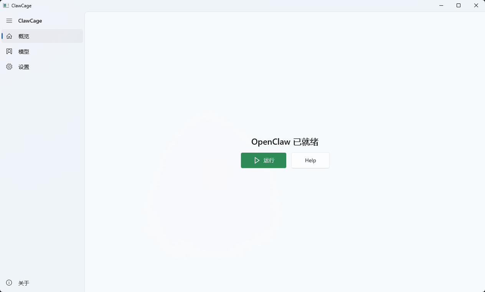

# ClawCage

ClawCage 是一款用于 **简化 OpenClaw 在 Windows 下部署与管理** 的桌面 GUI 工具。  
无需安装任何依赖，即可实现 **一键部署**、可视化管理，并支持 **Gateway（网关）/ Node（节点）模式** 快速切换。

> License: **AGPL-3.0**

---

## 界面展示

---

## 功能特性

- ** Windows 一键完成 OpenClaw 部署**
- ** GUI 可视化管理**
- ** Gateway / Node 模式一键切换**
- ** 无需安装任何依赖**（开箱即用）
- ** 简化配置与运维流程，降低使用门槛

---

## 系统要求

- Windows 10 / 11（推荐）
- 部分操作可能需要管理员权限（与网络/服务相关时）

---

## 快速开始

1. 下载 `ClawCage-win-Setup.exe` 并运行 ClawCage
2. 根据向导下载相关依赖
3. 在 GUI 中选择初始化：**Gateway（网关）** 模式
4. 在模型页面添加模型并配置相关参数
5. 点击“启动”完成 OpenClaw 
   后续可在界面中进行停止、重启、切换与管理等操作

---

## 项目定位

ClawCage 专注于 **Windows 环境下 OpenClaw 的快速部署与可视化管理**，适用于快速验证、演示与日常管理场景。

---

## 免责声明

本软件按“现状”提供，不对因使用本软件造成的任何直接或间接损失承担责任。请在受控环境中测试后再用于生产环境。

---

## 反馈与贡献

欢迎提交 Issue / PR 来改进 ClawCage（功能建议、Bug 反馈、文档完善等）。

## 开源许可（License）

本项目以 **GNU Affero General Public License v3.0 (AGPL-3.0)** 开源发布。  
当你分发本软件或将其用于对外提供时，请遵守 AGPL-3.0 的相关条款并保留许可声明。
---

<small><small><small>未经版权所有者书面授权，任何个人或组织不得对本软件及其修改版/衍生版进行售卖、转售、捆绑销售或付费分发等行为。</small></small></small> 
<small><small><small>版权所有者保留对本软件开展商业化运营及向第三方授予商业许可（商业授权）的权利。</small></small></small>

